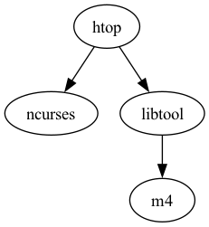

# Homebrew Dependency Analyzer


## Why
I was cleaning up my brew install and realized that there were a ton of packages installed that I really didn't know why or what installed them.  I started down the path of uninstalling a package, only to run into a dependency, so I would follow the thread and uninstall the dependency until I could finally remove the top level package. I realized I wanted to see the dependencies in tree form.  I looked briefly online, but like all good homebrew one-off scripts ... well.. here are the results.

This is a Python utility for macOS that helps you (the User) understand your Homebrew package installations and their dependency relationships. It will read a specific package or the whole install and dump the results out in usable formats.

## Summary of Features

- Visualize all installed formulae and casks with their dependencies
- Analyze specific packages to see the dependencies
- Generate visual dependency graphs (PNG, SVG, JPG)
- Tree view for terminal work


## Installation

### Prerequisites

- macOS with Homebrew installed
- Python 3.9+
- [uv](https://github.com/astral-sh/uv) package manager
- or .. you can power through pip like a caveman

### Setup

1. Clone or download this repository
2. Install Python dependencies using uv:

```bash
uv pip install networkx rich pydot
```

3. (RECOMMENDED) Install Graphviz for visual graph generation:

```bash
brew install graphviz
```

## Usage Examples

### Analyze a Formula

```bash
$ uv run brew_analyzer.py htop
```

Output:
```
Analyzing 'htop' (formula):
  Installed directly by user (it's a top-level package with no installed dependents).
  Directly depends on: ncurses, libtool
  Also depends on (transitive): ncurses, m4, libtool
```

### Display Dependency Tree

```bash
$ uv run brew_analyzer.py htop --format tree
```

Output:
```
Analyzing 'htop' (formula):
  Installed directly by user (it's a top-level package with no installed dependents).
  Directly depends on: ncurses, libtool
  Also depends on (transitive): m4, libtool, ncurses

Dependency tree for 'htop' (max depth 3):
htop
├── ncurses
└── libtool
    └── m4
```

### Analyze a Cask

```bash
$ uv run brew_analyzer.py ghostty
```

Output:
```
Analyzing 'ghostty' (cask):
  Name: Ghostty
  Description: Terminal emulator that uses platform-native UI and GPU acceleration
  Version: 1.1.3 (up to date)
  App: Ghostty.app
  Auto-updates: Yes
  Homepage: https://ghostty.org/
  Installed: 2025-06-07
```

### Generate Visual Graph

```bash
# Generate PNG for a specific package
$ uv run brew_analyzer.py htop --png
```

Output:
```
DOT graph saved to htop_dependencies.dot
Image saved to htop_dependencies.png
```

This creates a visual dependency graph like:



### Generate Graph for All Packages

```bash
$ uv run brew_analyzer.py --png
```

Creates `all_brew_dependencies.dot` and `all_brew_dependencies.png` showing your entire Homebrew dependency landscape.

## Command Reference

```
usage: brew_analyzer.py [-h] [--format {summary,tree,dot}] [--depth DEPTH]
                        [--output-file OUTPUT_FILE]
                        [--image-format {png,svg,jpg}] [--png] [--svg] [--jpg]
                        [--cask] [--refresh-cache]
                        [package]

positional arguments:
  package               Specific package to analyze (formula or cask)

options:
  -h, --help            show this help message and exit
  --format              Output format: summary, tree, or dot (default: summary)
  --depth DEPTH         Maximum depth for tree visualization (default: 3)
  -o, --output-file     Output file name for DOT graph
  --image-format        Image format: png, svg, or jpg
  --png                 Shorthand for --format dot --image-format png
  --svg                 Shorthand for --format dot --image-format svg
  --jpg                 Shorthand for --format dot --image-format jpg
  --cask                Specify that the package is a cask
  --refresh-cache       Force refresh Homebrew data (ignores cache)
```

**Note:** Specifying `--image-format` automatically sets `--format dot`.

## Cache

The tool caches Homebrew data for 1 hour to improve performance. Cache is stored in `.brew_analyzer_cache/brew_data.json`.

To force a refresh:
```bash
uv run brew_analyzer.py --refresh-cache
```
or just delete the json file, it will get recreated on next run.

## How It Works

1. Fetches package information from Homebrew using `brew info --json=v2`
2. Builds a directed graph using NetworkX where nodes are packages and edges are dependencies
3. Analyzes the graph to determine:
   - Reverse dependencies (what depends on this)
   - Transitive dependencies (all indirect dependencies)
   - Top-level packages (no installed packages depend on them)
4. Visualizes using Rich (terminal) or Graphviz (images)

## Troubleshooting

**"Error: 'dot' command not found"**
- Install Graphviz: `brew install graphviz`

**Slow performance**
- First run is slow (fetches all package data)
- Subsequent runs use cached data (1 hour expiration)
- Force refresh: `--refresh-cache`

**Package not found**
- Ensure the package name is correct (case-sensitive)
- Check it's installed: `brew list`

## License

This project is provided as-is for personal use.
